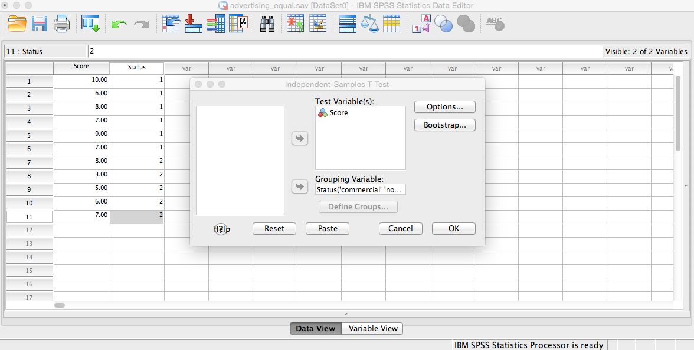
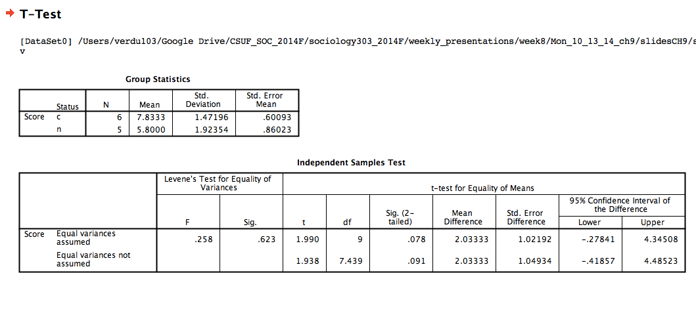
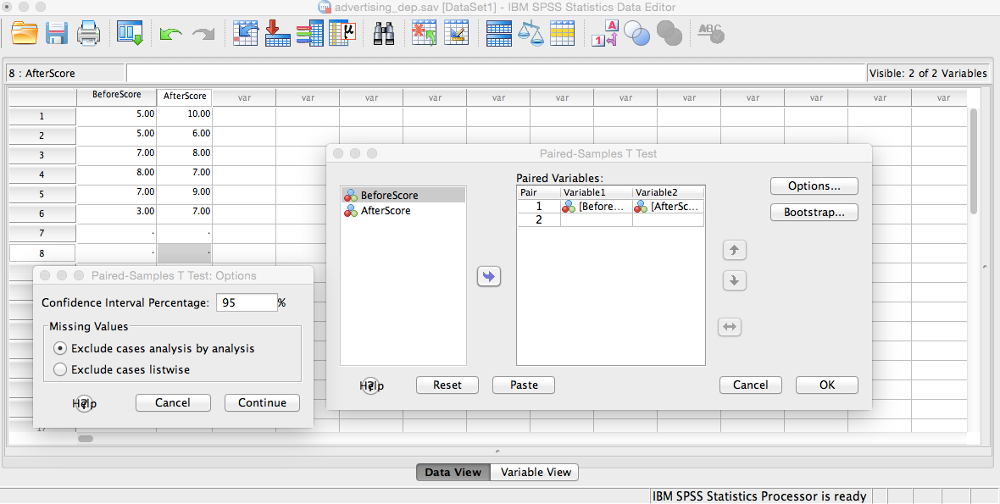
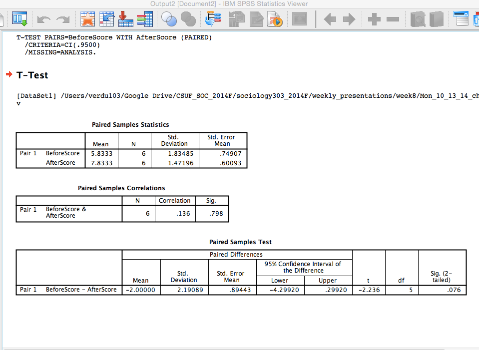

# Monday 9/13/14 Lecture

--- .class #title

## Topics for this Week

1. Recap
2. Homework 2 is due
3. Chapter 9 Part I Monday
4. Examples of z scores are on the class website
5. Feedback will be on the class portal for each assignment
6. Winners will be announced on Wednesday
7. Wed. we will be doing a mock research project from start to finish
8. Chapter 10

--- .class #topics 

## Chapter 9 Two-Sample t-Tests 

### Prologue and Introduction

We are studying a family of tests in statistics named, the t-tests. This time, we can look at introducing more than one group of individuals to study. We are learning how to look at groups statistically. This chapter builds from chapters 6, 7, and 8.

Remember when I mentioned that we should be able to remember what equation we need to use for the data that we have. The equation we use is always decided by the data!

--- .class #prologue

## Outline

1. Independent Samples Versus Dependent Samples
2. The Two-Sample t Test (INDEPENDENT DRAWN SAMPLES)
3. Adjustments for Sigma-Hat Squared $\hat{\sigma}^2$
4. Interpreting a Computer-Generated t Test
5. Computer Applications: Independent Samples t Tests
6. The Two-Sample t Test for Dependent Samples
7. Computer Applications: Dependent Samples t Tests
8. Statistical Significance versus Research Significance
9. Statistical Power
10. Conclusions

--- .class #outline

## Independent Samples Versus Dependent Samples

* Independent Samples (Independent Drawn Samples) [PAGE 273]
    * The composition of one sample is in no way matched or paired to the composition of the other sample. Thus, the two samples reflect two *SEPARATE POPULATIONS*

* Dependent Samples: Matched Pairs [PAGE 275]
    * Situation in which members of one sample are not selected independently, but are instead determined by the makeup of the other sample. (they reflect the other group but are NOT THE SAME GROUP.)
* Dependent Samples: Matched Pairs (paired difference) t test [PAGE 275]
    * The t test used when the two samples are dependent samples.

--- .class #id1

### INDEPENDENT SAMPLES t-Test
* The first introductory t-Test from previous chapters assumes *INDEPENDENT SAMPLES*
* CHARACTERISTICS 
    * Two separate groups that are NOT matched or paired on any criteria
    * Two Samples REFLECT two DIFFERENT POPULATIONS
    * Group 1 and 2 has it's own: 
        * sample size $n$
        * mean $\bar{x}$ 
        * variance $\sigma^2$ or $s^2$ (for now we are using $s^2$ versus $\sigma^2$)
        * standard deviation (the $\sqrt{variance}$)
    * Hypotheses
        * NON-DIRECTIONAL: $H_0: \mu_1 = \mu_2$ and $H_1:\mu_1 \neq \mu_2$
        * DIRECTIONAL (IF PRIOR KNOWLEDGE INDICATES THIS): 
            * $H_0: \mu_1 > \mu_2$ and $H_1:\mu_1 < \mu_2$
            * $H_0: \mu_1 < \mu_2$ and $H_1:\mu_1 > \mu_2$

--- .class #id2

### Relationship between Independent Samples and Population

SAMPLE 1                | SAMPLE 2
------------------------|------------------
Size $n_1$              | Size $n_2$
Mean $\mu_1$            | Mean $\mu_2$
Variance $s_1^2$        | Variance $s_2^2$
$\bigg\uparrow$         | $   \bigg\uparrow$
POP1                    | POP 2
$\mu_1$  unknown        | $\mu_2$ unknown
$\sigma_1^2$ unknown    | $\sigma_2^2$ unknown

--- .class #id2

### Examples of Independent Samples and Populations

**THESE ARE NOT MATCHED AT ALL!!!!**

* Participants randomly selected to receive a placebo and medication
    * Group 1 = Placebo
    * Group 2 = Medication
    
PLACEBO                 | MEDICATION
------------------------|------------------
Size $n_1=6$            | Size $n_2=5$
Mean $\bar{x_1}$        | Mean $\bar{x_2}$
Variance $s_1^2$        | Variance $s_2^2$
$\bigg\uparrow$         | $\bigg\uparrow$
POPULATION 1            | POPULATION 2
$\mu_1$ is unknown      | $\mu_2$ is unknown
$\sigma_1^2$ is unknown | $\sigma_2^2$ is unknown

* Participants randomly selected to receive a training and non-training
    * Group 1 = Training
    * Group 2 = Non-Training
* Participants randomly selected to view advertising and not view advertising
    * Group 1 = Advertising
    * Group 2 = Non-Advertising

--- .class #id3

## The Two-Sample t Test (INDEPENDENT DRAWN SAMPLES)

* Pooled Estimate of Common Variance [PAGE 276]
    * Estimate based on a weighted average of two sample variances being used to estimate the population variance in finding the standard error.
* F test for Homogeneity of Variance [PAGE 276]
    * A test, based on the sample variances, used to determine the most appropriate $t$ test formula to use.

--- .class #2sampIND

### Steps for Two-Sample t Test (INDEPENDENT DRAWN SAMPLES)

1. Write out Hypotheses for the original problem (comparison of the two sample means)
    * The Null $H_0$ 
    * The Alternative $H_1$
2. For EACH SAMPLE
    * $n_1$ (sample size) and $n_2$ (sample size)
    * $\bar{x_1}$ (mean) and $\bar{x_2}$ (mean)
    * $s_1^2$ (sample variance) and $s_2^2$ (sample variance)
3. HOW TO DETERMINE WHICH t formula to use
    * for EQUAL OR UNEQUAL VARIANCES use the F test for Homogeneity of Variances
        * Write out the $H_0$ and $H_1$ for the F Test
        * Calculate F and it's two degrees of freedom
        * Compare the obtained F to $F_{critical}$, .05 level (from the F table pp. 566-568)
        * Decisions for F
            * If $F_{obtained} \geq F_{critical}$ ASSUME UNEQUAL POPULATION VARIANCES
            * If $F_{obtained} \leq F_{critical}$ ASSUME EQUAL POPULATION VARIANCES
4. Perform the appropriate $t$ test as determined by the $F$ test

--- .class #2sampINDsteps

### t-test Solving Example 1 Page 277: EQUAL VARIANCES

* Scenario: T.V. Commercial.
* A group of 6 people are assigned to the experimental group and will see a commercial. Those 6 people in the experimental group will then evaluate the product's favor ability. Next, 5 people will be assigned to the control group and then evaluate the product's favor ability without seeing the commercial. In addition, the marketing department has indicated that the commercial has been rated as favorable in the past.

STEP ONE: Write out $H_0$ and $H_1$
    * WE USE DIRECTIONAL BECAUSE OF PREVIOUS INFORMATION FROM THE MARKETING DEPARTMENT.
    * Experimental group saw the commercial
    * Control group did not see the commercial
    * $H_0: \mu_{experimental} = \mu_{control}$
    * $H_1: \mu_{experimental} > \mu_{control}$

--- .class #sampINDEX1

### t-test Solving Example 1 Page 277

STEP TWO: Determine $n$, $\bar{x}$, and $s^2$ for each group

Experimental Group | Control Group
-------------------|---------------
$x_{experimental}$ | $x_{control}$
10                 | NA
6                  | 8
8                  | 3
7                  | 5
9                  | 6
7                  | 7

* $n_{experimental}=6$ and $n_{control}=5$
* $\bar{x}_{experimental}=47$ and $\bar{x}_{control}=29$
* Means for our groups
    * $\bar{x}_{experimental}=\frac{\Sigma x_{experimental}}{n_{experimental}}=\frac{47}{6}=7.83$
    * $\bar{x}_{control}=\frac{\Sigma x_{control}}{n_{control}}=\frac{29}{5}=5.80$

--- .class #sampINDEX2

### t-test Solving Example 1 Page 277

STEP THREE: Calculate the Variance (from scratch, these may or may not be provided to you in an exam or homework...know this skill even if you don't need it for a particular problem.) 
    * Square the raw scores
    
Experimental Group  | Control Group
--------------------|---------------
$x_{experimental}$  | $x_{control}$
100                 | NA
36                  | 64
64                  | 9
49                  | 25
81                  | 36
49                  | 49

    * For Experimental Variance

$\Sigma x_1^2 = 379$
    
$s_1^2 = \frac{\Sigma x_1^2 - \frac{(\Sigma x_1)^2}{n_1}}{n_1}$ =$s_1^2 = \frac{379 - \frac{(47)^2}{6}}{6}$ = $s_1^2 = \frac{379 - \frac{2206}{6}}{6}$ =$s_1^2 = \frac{379 - 368.17}{6}$ =$s_1^2 = 1.81$

    * For Control Variance

$\Sigma x_2^2= 183$ 

$s_2^2 = \frac{\Sigma x_2^2 - \frac{(\Sigma x_2)^2}{n_2}}{n_2}$ =$s_2^2 = \frac{183 - \frac{(29)^2}{5}}{5}$ = $s_2^2 = \frac{183 - \frac{841}{5}}{5}$ =$s_2^2 = \frac{183 - 168.2}{5}$ = $s_2^2 = 2.96$

--- .class #sampINDEX3

### Summarizing the results So Far

Experimental     | Control
-----------------|---------
$n_1=6$          | $n_2=5$
$\bar{x_1}=7.83$ | $\bar{x_2}=5.80$
$s_1^2 = 1.81$   | $s_2^2 = 2.96$

--- .class #sampINDEX4

### Perform the F Test for the Variances

* F test Hypothesis 

$H_0: \sigma_1^1 = \sigma_2^1$ and $H_1: \sigma_1^1 \neq \sigma_2^1$

* F test Statistic

$F = \frac{s^2_{larger}}{s^2_{smaller}}$ = $F = \frac{2.96}{1.81}$ = $F = 1.64$ with 

$df_{numerator}$ and $df_{denominator}$ ==> This is 2 steps!

$df_{numerator}=n_1 - 1 = 5-1 = 4$ and $df_{denominator}=n_2 - 1 = 6-1 = 5$

*Result* 

$F_{OBTAINED} = 1.64$  and $F_{CRITICAL} = 5.19$ with $df=(4,5)$ and our final decision for the equation to use is:

$F_{OBTAINED} = 1.64 < F_{CRITICAL 0.5} = 5.19 (df=4 and 5)$

We do NOT REJECT THE Null and conclude that we use the 

**t test for EQUAL Population Variances**

*rarely do we have to change our test statistic because F is calculated from the sample or the population*

--- .class #sampINDEX5

### Calculate the test statistic: t Test for EQUAL POPULATION VARIANCES

$t = \frac{\bar{x_1} - \bar{x_2}}{\sqrt{\bigg(\frac{n_1s_1^2 +n_2s_2^2}{n_1+n_2-2}\bigg)\bigg(\frac{1}{n_1}+\frac{1}{n_2}\bigg)}}$

* Where $df = n_1 + n_2 = 2$

* PRO TIP:  "Solve this big equation by finding the components and then plugging them into the equation at the end."

$\bar{x}_1 - \bar{x}_2 = 7.83 - 5.80 = 2.03$

$\frac{n_1s_1^2 + n_2s_2^2}{n_1+n_2-2}$ = $\frac{6(1.81)+5(2.96)}{6+5-2}$ = $\frac{10.86+14.80}{11-2}$=$\frac{25.66}{9}=2.85$

$\frac{1}{n_1}+\frac{1}{n_2}$=$\frac{1}{6}+\frac{1}{5}$= $0.17+0.20 = 0.37$

$\sqrt{\bigg( \frac{n_1s_1^2 + n_2s_2^2 }{n_1+n_2-2}\bigg) \bigg( \frac{1}{n_1} + \frac{1}{n_2} \bigg)}$ = $\sqrt{(2.85)(0.37)}$ = $\sqrt{1.0545}$ = $1.0268$ 

* This is where we calculate t:

$t = \frac{\bar{x_1} - \bar{x_2}}{\sqrt{\bigg(\frac{n_1s_1^2 +n_2s_2^2}{n_1+n_2-2}\bigg)\bigg(\frac{1}{n_1}+\frac{1}{n_2}\bigg)}}$ = $\frac{2.03}{1.0268}$ = $1.9708$ = $t_{obtained}=1.971$

Degrees of Freedom $df=n_1+n_2-2 = 6+5-2 =11-2 = 9$

--- .class #sampINDEX6

**COMPARE t test calculate to critical for decision on rejecting the null hypothesis**

* $t_{critical}$ is for a DIRECTIONAL $H_1$ at $\alpha=0.5$

Decisions: remember we are using DIRECTIONAL here

* One Tail: At $\alpha = 0.025$ level, $t_{critical}(df=9) = 2.262 > 1.971$ SINCE $p < 0.05$
* Two Tail: At $\alpha=0.05$ level, $t_{critical}(df=9) = 1.833 < 1.971$

**We use the One Tail ONLY FOR THIS LONG EXAMPLE. We conclude the following:**

We reject $H_0$ in favor of the alternative $H_1$ such that $\mu_1 > \mu_2$. This particular commercial does increase favor ability ratings of the product! We tell the marketing department that if the assumption that the entire consumer population had viewed the commercial then their mean support score would increase.

--- .class #sampINDEX7

### t-test Solving Example 1 Page 283: UNEQUAL VARIANCES

What if our example had different scores? Let's revisit the problem with some new scores and see what happens when we have UNEQUAL VARIANCES.

Experimental Group | Control Group
-------------------|---------------
$x_{experimental}$ | $x_{control}$
10                 | NA
6                  | 10
8                  | 1
7                  | 3
9                  | 6
7                  | 9

* $n_{experimental}=6$ and $n_{control}=5$
* $\bar{x}_{experimental}=47$ and $\bar{x}_{control}=29$
* Means for our groups
    * $\bar{x}_{experimental}=\frac{\Sigma x_{experimental}}{n_{experimental}}=\frac{47}{6}=7.83$
    * $\bar{x}_{control}=\frac{\Sigma x_{control}}{n_{control}}=\frac{29}{5}=5.80$

--- .class #sampINDUN1

Calculate the Variance (from scratch, these may or may not be provided to you in an exam or homework...know this skill even if you don't need it for a particular problem.) 

* Square the raw scores
    
Experimental Group  | Control Group
--------------------|---------------
$x_{experimental}$  | $x_{control}$
100                 | NA
36                  | 100
64                  | 1
49                  | 9
81                  | 36
49                  | 81

    * For Experimental Variance

$\Sigma x_1^2 = 379$ 

$s_1^2 = \frac{\Sigma x_1^2 - \frac{(\Sigma x_1)^2}{n_1}}{n_1}$ = $s_1^2 = \frac{379 - \frac{(47)^2}{6}}{6}$ = $s_1^2 = \frac{379 - \frac{2206}{6}}{6}$

$s_1^2 = \frac{379 - 368.17}{6}$ =$s_1^2 = 1.81$

    * For Control Variance

$\Sigma x_2^2= 227$ 

$s_2^2 = \frac{\Sigma x_2^2 - \frac{(\Sigma x_2)^2}{n_2}}{n_2}$ = $s_2^2 = \frac{227 - \frac{(29)^2}{5}}{5}$

$s_2^2 = \frac{227 - \frac{841}{5}}{5}$ = $s_2^2 = \frac{227 - 168.2}{5} = \frac{58.8}{5} = 11.76$

--- .class #sampINDUN2

### Summarizing the results So Far

Experimental     | Control
-----------------|---------
$n_1=6$          | $n_2=5$
$\bar{x_1}=7.83$ | $\bar{x_2}=5.80$
$s_1^2 = 1.81$   | $s_2^2 = 11.76$

--- .class #sampINDUN3

### Next, Perform the F Test for the Variances

* F test Hypothesis 

$H_0: \sigma_1^1 = \sigma_2^1$ and $H_1: \sigma_1^1 \neq \sigma_2^1$

* F test Statistic

$F = \frac{s^2_{larger}}{s^2_{smaller}}$ = $F = \frac{11.76}{1.81}$ = $F = 6.497$ with  $df_{numerator}$ and $df_{denominator}$ ==> This is 2 steps!

$df_{numerator}=n_1 - 1 = 5-1 = 4$ and $df_{denominator}=n_2 - 1 = 6-1 = 5$

*Result* 

$F_{OBTAINED} = 6.497$  and $F_{CRITICAL} = 5.19$ with $df=(4,5)$ and our final decision for the equation to use is:

$F_{OBTAINED} = 6.497 > F_{CRITICAL 0.5} = 5.19 (df=4 and 5)$

We REJECT THE Null and conclude that we use the 

**t test for UNEQUAL Population Variances**

*rarely do we have to change our test statistic because F is calculated from the sample or the population*

--- .class #sampINDUN4

Again, we calculate the test statistic: t Test BUT THIS TIME WE USE THE UNEQUAL POPULATION VARIANCES

$t = \frac{\bar{x_1}-\bar{x_2}}{\sqrt{\frac{s_1^2}{n_1-1} + \frac{s_2^2}{n_2-1}}}$

* $df$ Estimate: whichever $n$ is smaller
* $df$ Exact:

$df_{exact}=\frac{\big(\frac{s_1^2}{n_1 - 1}+\frac{s_2^2}{n_2-2}\big)^2}{\Bigg[\frac{\big(\frac{s_1^2}{n_1-1}\big)^2}{\big(n_1-1\big)}\Bigg]+\Bigg[\frac{\big(\frac{s_2^2}{n_2-1}\big)^2}{\big(n_2-1\big)}\Bigg]}$

* PRO TIP:  "Solve this big equation by finding the components and then plugging them into the equation at the end."

$\bar{x}_1 - \bar{x}_2 = 7.83 - 5.80 = 2.03$

$\frac{s_1^2}{n_1-1}=\frac{1.81}{6-1}=\frac{1.81}{5}=0.36$
$\frac{s_2^2}{n_2-1}=\frac{11.76}{5-1}=\frac{11.76}{4}=2.94$

$\sqrt{\frac{s_1^2}{n_1-1} +\frac{s_2^2}{n_2-1}}=\sqrt{0.36 + 2.94}=\sqrt{3.3}=1.82$

* This is where we calculate t:

$t = \frac{\bar{x_1}-\bar{x_2}}{\sqrt{\frac{s_1^2}{n_1-1} + \frac{s_2^2}{n_2-1}}}$

$t = \frac{2.03}{1.82}=1.115$

--- .class #sampINDUN4

*Decisions:* $df=n_2=5$ or you can use the exact df equation.

**COMPARE t test calculate to critical for decision on rejecting the null hypothesis**

* $t_{obtained=1.115}$

* $t_{critical}$ is for a DIRECTIONAL $H_1$ at $\alpha=0.5$

Decisions: remember we are using DIRECTIONAL here

* One Tail: At $\alpha = 0.025$ level, $t_{critical}(df=9) = 2.262 > 1.971$ SINCE $p < 0.05$
* Two Tail: At $\alpha=0.05$ level, $t_{critical}(df=9) = 1.833 < 1.971$

**We use the One Tail ONLY FOR THIS LONG EXAMPLE. We conclude the following:**

We CANNOT reject $H_0$ in favor of the alternative $H_1$ such that $\mu_1 > \mu_2$. This particular commercial does NOT increase favor ability ratings of the product! We tell the marketing department that if the assumption that the entire consumer population had viewed the commercial then their mean support score would NOT increase.

--- .class #sampINDUN5

## The DF long way for UNEQUAL VARIANCES

The equation for this procedure is: 

$df_{exact}=\frac{\big(\frac{s_1^2}{n_1 - 1}+\frac{s_2^2}{n_2-2}\big)^2}{\Bigg[\frac{\big(\frac{s_1^2}{n_1-1}\big)^2}{\big(n_1-1\big)}\Bigg]+\Bigg[\frac{\big(\frac{s_2^2}{n_2-1}\big)^2}{\big(n_2-1\big)}\Bigg]}$

To solve it, using the previous example, we would find the components piece by piece and then plug them in to solve the equation. 

--- .class #df1

## Steps for the df calculation the long way:

* Step One df: $\frac{s_1^2}{n_1-1}=\frac{1.81}{6-1}=\frac{1.81}{5}=0.36$
* Step Two df: $\bigg( \frac{s_1^2}{n_1-1} \bigg)^2=(.36)^2=0.13$
* Step Three df: $\frac{s_2^2}{n_2-1}=\frac{11.76}{5-1}=\frac{11.76}{4}=2.94$
* Step Four df: $\bigg( \frac{s_2^2}{n_2-1} \bigg)^2=(2.94)^2=8.64$
* Step Five df: $\bigg( \frac{s_1^2}{n_1-1} + \frac{s_2^2}{n_2-1} \bigg)^2=(0.36 + 2.94)^2=(3.30)^2=10.89$

--- .class #df2

## Steps for the df calculation the long way:

* Step Six df: $\frac{\bigg( s_1^2\bigg)^2}{(n_1-1)}=\frac{0.13}{6-1}=\frac{0.13}{5}=0.26 \approx 0.3$
* Step Seven df: $\frac{\bigg( s_2^2\bigg)^2}{(n_2-1)}=\frac{8.64}{5-1}=\frac{8.64}{4}=2.16$
* Step Eight df FINAL STEP!:  
$df_{exact}=\frac{\big(\frac{s_1^2}{n_1 - 1}+\frac{s_2^2}{n_2-2}\big)^2}{\Bigg[\frac{\big(\frac{s_1^2}{n_1-1}\big)^2}{\big(n_1-1\big)}\Bigg]+\Bigg[\frac{\big(\frac{s_2^2}{n_2-1}\big)^2}{\big(n_2-1\big)}\Bigg]}=\frac{10.89}{0.3+2.16}=4.97$

--- .class #df3

## Drum roll for the result!

* The computer would list this as df = 4.97 
* DO NOT ROUND UP.
* The final df = 4

* We still have the same result, but sometimes this is a slight issue. Go with the computer generated values for most of the time. Rarely, do we ever do this by hand again. Well, unless our computers fail!

* Result: $t_{critical}$, one-tailed, $0.05 \alpha$ level, with $df=4$
* 2.32 > 1.15 and we CAN NOT REJECT THE $H_0$ IN FAVOR OF THE $H_1$

--- .class #dfex3

## Warnings about directional hypotheses.

* Always use the critical value for the $\alpha$ that is given. Usually 0.05.
* Decide on one or two tail and stick with that decision throughout the analysis. Do not mix up the critical values for one tail or two tail for comparing your obtained statistic. If you pick one tail....STICK TO ONE TAIL!
* One tail requires prior knowledge to make that "leap" of statistical faith.

--- .class #hypwarning

# Wednesday 10/15/14 Lecture

--- .class #wed

## Adjustments for Sigma-Hat Squared $\hat{\sigma}^2$

Sometimes we are calculating the test statistic from an estimate of the population parameters from sample data. This is $\hat{\sigma}^2$. 

### Variance Estimate: Sigma Hat Squared Equation

$\hat{\sigma}^2=\frac{\Sigma(x-\bar{x})^2}{n-1}$

### Standard Deviation Estimate: Sigma Hat Equation

$\hat{\sigma}=\sqrt{\frac{\Sigma(x-\bar{x})^2}{n-1}}$

--- .class #sigmahat

### Revisiting the Advertising Problem

Sample 1                | Sample 2
------------------------|----------
$n_1=6$                 | $n_1=5$
$\bar{x}_1=7.83$        | $\bar{x}_2=5.80$
$\hat{\sigma}_1^2=2.17$ | $\hat{\sigma}_2^2=3.70$

First, we have to adjust for the use of an estimate of variance using the t-equation. Our equation is: **Equal Population Variances Assumed**

$t=\frac{\bar{x_1}-\bar{x_2}}{denominator}$

Where the $denominator= \sqrt{ \Bigg[ \frac{(n_1-1)\hat{\sigma_1^2}+(n_2-1)\hat{\sigma_2}^2}{n_1+n_2-2} \Bigg] \Bigg[ \frac{1}{n_1} + \frac{1}{n_2}\Bigg]}$

* Where $df=n_1+n_2-2$ and for our problem $df=6+5-2=11-2=9$

--- .class #sigmahat1

## Solving our new problem Equal Variances

* Step One find the components of the large equation

The numerator: $\bar{x}_1-\bar{x}_2=7.83-5.80=2.03$

The denominator components:

$\bigg[\frac{1}{n_1}+\frac{1}{n_2}\bigg]=\bigg[\frac{1}{6}+\frac{1}{5}\bigg]=0.37$

$\frac{(n_1-1)\hat{\sigma_1^2}+(n_2-1)\hat{\sigma_2}^2}{n_1+n_2-2}=\frac{(6-1)(2.17)+(5-1)(3.70)}{6+5-2}=\frac{5(2.17)+4(3.70)}{11-2}=\frac{10.85+14.80}{9}=\frac{25.65}{9}=2.85$

* Step Two calculate the t statistic:

$t=\frac{2.03}{\sqrt{(2.85)(0.37)}}=\frac{2.03}{\sqrt{1.0545}}=\frac{2.03}{1.026889}=1.976846 \approx 1.977$

--- .class #sigmahat2

## Revisiting the Advertising Problem: UnEqual Variances

### Using sigma hat again.

Sample 1                | Sample 2
------------------------|----------
$n_1=6$                 | $n_1=5$
$\bar{x}_1=7.83$        | $\bar{x}_2=5.80$
$\hat{\sigma}_1^2=2.17$ | $\hat{\sigma}_2^2=14.70$

First, we have to adjust for the use of an estimate of variance using the t-equation. Our equation is: **Unequal Population Variances Assumed**

$t = \frac{\bar{x_1}-\bar{x_2}}{\sqrt{\frac{\hat{\sigma}_1^2}{n_1}+\frac{\hat{\sigma}^2_2}{n_2}}}$

* $df$ Estimate: whichever $n$ is smaller
* $df$ Exact:

$df_{exact}=\frac{\bigg( \frac{\hat{\sigma}^2_1}{n_1} + \frac{\hat{\sigma}^2_2}{n_1}  \bigg)^2}{\Bigg[\frac{\bigg( \frac{\hat{\sigma}^2_1}{n_1}\bigg)^2}{n_1-1} \Bigg] + \Bigg[ \frac{\bigg( \frac{\hat{\sigma}^2_2}{n_2}\bigg)^2}{n_2-1}\Bigg]}$

--- .class #sigmahat3

## Steps to Solve

* Step One find the components of the large equation

The numerator: $\bar{x}_1-\bar{x}_2=7.83-5.80=2.03$

The denominator components:

$\sqrt{\frac{\hat{\sigma}_1^2}{n_1}+\frac{\hat{\sigma}^2_2}{n_2}}$

This works out to be: $\sqrt{\frac{2.17}{6}+\frac{14.7}{6}}=\sqrt{.36+2.94}=\sqrt{3.3}=1.82$

* Step Two calculate the t statistic: $t=\frac{2.03}{1.82}=1.115$ 

--- .class #sigmahat4

### The Degrees of Freedom for our problem

* $df$ Estimate: whichever $n$ is smaller = 5
* $df$ Exact:

$df_{exact}=\frac{\bigg( \frac{\hat{\sigma}^2_1}{n_1} + \frac{\hat{\sigma}^2_2}{n_1}  \bigg)^2}{\Bigg[\frac{\bigg( \frac{\hat{\sigma}^2_1}{n_1}\bigg)^2}{n_1-1} \Bigg] + \Bigg[ \frac{\bigg( \frac{\hat{\sigma}^2_2}{n_2}\bigg)^2}{n_2-1}\Bigg]} = 4.97$

--- .class #sigmahat5

## Interpreting a Computer-Generated t Test

Sometimes, we have a lot of data to look at. Calculating the statistic would be extremely difficult! We can use SPSS (and in other classes we can use other programs like SAS, R, Excel, etc.). Let's try to do this by using SPSS.

Let's use our data and put that into SPSS.

* Step 1: Open SPSS
* Step 2: Enter the data or read the data into SPSS
          
          * This is counter-intuitive...you must enter the data in a specific way for this to work! It is not the same way you would do this in any other program. It is specific to SPSS. I have saved this exercise as a .sav file for you to read into SPSS.
          

## Analyzing data in SPSS: t test independent

* Step 3: Click on Analyze-->Compare Means-->Independent Samples
          
          * Be sure to click on define groups

--- .class #interp1

* Step 4: The result

Interpretation:

1. $F = .258$ and significance = .623 we cannot reject a null hypothesis: Equal variances assumed!
2. $t = 1.990$ and our significance is 0.078 (this time it's for a two tailed.) UH OH! Now What? We divide the significance by 2. $sig=0.039$ which is slightly more than .025. We CAN reject the $H_0$ this time. 

The significance for this test is the displayed significance divided by two. Since the t statistic has a symmetrical distribution, the "significant" tails will have the same probability (e.g. in a two-tailed test, a .05 criteria reflects that the .025 tails will reflect significance). Since we are looking at only one of those tails, we would divide the significance in half to determine if the t statistic is significant or not.

--- .class #interp2

### Rules for interpreting the output from SPSS

1) Examine the probability of $F$. <- THIS IS TWO TAILED!
          
1.1 If the probability of $F > .05$ we cannot reject a null of equal population variances and assume equal population variances.  *use the Equal variances*
          
1.2 If the probability of $F \leq .05$ we reject the $H_0$ and assume unequal population variances. *use the UNEqual variances*

2) Examine the appropriate t statistic (equal or unequal variances) <- Based on your decision for directional or non-directional hypothesis.

2.1 If the probability of significance (Sig.) of $|t| > .05$ we **DO NOT** REJECT the initial $H_0$ (two tailed)

2.2 If the probability of significance (Sig.) of $|t| \leq .05$ we **REJECT** the t test's $H_0$ in favor of the $H_1$ (for one tail lower)

2.3 *If the probability of significance (Sig.) of $|t| \geq .05$ we **REJECT** the t test's $H_0$ in favor of the $H_1$. (for one tail extreme)

--- .class #interp3

## The Two-Sample t Test for Dependent Samples

* The infamous and interesting dependent or matched samples t tests!
* Paired Difference t test [PAGE 298]
    * A one-sample $t$ test applied to the differences in each pairs of scores.

Some people will call this a repeated measures if the people are being exposed to the non-treatment and then the treatment. It's also called pre-post test because you can pair the scores up with the people taking the test before and after the exposure. So for stats, we could do this by giving you a pre-test and then giving you a post-test. 

--- .class #pairedt1

### Example Paired Difference t test

Here's an example with our favorite Ad company: Titan Data Bandits. We want to see how well people view CSUF before an ad campaign starts. Our savvy leader, Rosie the Data Bandit has decided that we are going to be giving people a survey on our CSUF community. After that survey, those **SAME EXACT PEOPLE** are going to take the survey again and rate the CSUF community. Also, Rosie has used this commercial before and had favorable ratings. Sounds easy enough. What's our data?

Before          | After
----------------|------------
5               | 10
5               | 6
7               | 8
8               | 7
7               | 9
3               | 7
$\Sigma X_b=35$ | $\Sigma X_a=47$
$n_b = 6$       | $n_a = 6$
$\bar{X}_b=5.83$| $\bar{X}_a=7.83$

--- .class #pairedt2

### Step One: Write the Hypothesis....it is directional!

$H_0: \mu_{before} = \mu_{after}$ and $H_1: \mu_{before} < \mu_{after}$

But we can write this a statement about the differences...since that is really what we are looking at as well.

$H_0: \mu_D = 0$ and $H_1: \mu_D > 0$

Think about this step critically...you want to ensure that you are using the right hypothesis. Remember that we only use directional if we have a pretty good idea that the hypothesis is directional *based* on previous knowledge!

--- .class #pairedt3

## Step Two: Identify the equation.

This is easy...right? We saw that Rosie had *matched* the scores by using the *same* people. DO NOT MAKE ASSUMPTIONS. IF THE STATEMENT DOES NOT SAY ANYTHING ABOUT MATCHING...THEN IT IS NOT A PAIRED TEST! Do not make this mistake!

**Dependent Samples** 

$t = \frac{\bar{D}}{\frac{S_D}{\sqrt{n_p -1}}}$

* Where $S_D=\sqrt{\frac{\Sigma(D-\bar{D})^2}{n_p}}$ and $df=n_p -1$

What does this mean, you might ask. Glad you asked. 

* $n_p$: the number of matched pairs of scores in the sample
* $D$: the difference ($after_{score}-before{score}$) for each pair of scores in the sample.
* $\bar{D}$ is the mean of all our sample's difference scores (retaining their + or - signs).
* $S_D$ is the sample standard deviation of the difference scores
$S_D=\sqrt{\frac{\Sigma(D-\bar{D})^2}{n_p}}$

--- .class #pairedt4

### Steps to solve our problem!

1. Subtract each before score from each after score to get each $D$
2. Add the $D$s algebraically to get $\Sigma D$ and Divide $\Sigma D$ by $n_p$ to get $\bar{D}$
3. Subtract $\bar{D}$ to get $(D-\bar{D})$
4. Square each $(D-\bar{D})$ to get $(D-\bar{D})^2$ 
5. Add together each $(D-\bar{D})$ to get $\Sigma(D-\bar{D})^2$ <- plug this into the $S_D$ formula
6. Divide $\Sigma(D-\bar{D})^2$ by $n_p$ to get the variance of sample differences
7. Take the square root of the variance to reveal $S_D$

**Ready**....let's take this equation for a test drive!

--- .class #pairedt5

### Back to Solving our Problem for Rosie

We notice a small problem with the numbers entered....it turns out some of the numbers had been switched. Pesky data entry people!

Before | After | Step1:D | Step3:$D-\bar{D}$| Step4:$(D-\bar{D})^2$
-------|-------|---------|------------------|----------------------
5      | 10    | 5-10 = 5| $5-2=3$          | $3^2  =9$ 
5      | 6     | 5-6  = 1| $1-2=-1$         | $-1^2 =1$
7      | 8     | 7-8  =-1| $-1-2=-3$        | $-3^2 =9$
8      | 7     | 8-7  = 1| $1-2=-1$         | $-1^2 =1$
9      | 7     | 9-7  = 2| $2-2=0$          | $0^2 = 0$
3      | 7     | 7-3  = 4| $4-2=2$          | $2^2 = 4$

--- .class #pairedt6

## Steps to solve!

* Sum for Step 1: $\Sigma D = 5+1-1+1+2+4 = 12$  
* Step 2: $\bar{D}= \frac{\Sigma D}{n_p}= \frac{12}{6} = 2$
* Step 5: $\Sigma(D-\bar{D})^2=9+1+9+1+0+4=24$
* Step 6 & 7: Plug into our equation
$S_D=\sqrt{\frac{\Sigma(D-\bar{D})^2}{n_p}}=\sqrt{\frac{24}{6}}=\sqrt{4}=2$
* Step 8: Complete the t equation for paired t.
$t = \frac{\bar{D}}{\frac{S_D}{\sqrt{n_p -1}}}=\frac{2}{\frac{2}{\sqrt{6-1}}}$

* Where $S_D=\sqrt{\frac{\Sigma(D-\bar{D})^2}{n_p}}$ and $df=n_p -1$

Consolidate our terms: $t=\frac{2}{\frac{2}{\sqrt{6-1}}}=\frac{2}{\frac{2}{\sqrt{5}}}$ Just move the $\sqrt{5}$ to the numerator, cancel the 2s and solve!

$\frac{2\sqrt{5}}{2}=\sqrt{5}=2.236068 \approx 2.236$ where $df=n_p-1=6-1=5$

Our result can be written like this $t_{obtained}=2.236$ with $df=5$. 

--- .class #pairedt7

The decision is as follows:

For the one tail (so we know that the one tail is really split in half): $t_{critical}.05 \alpha level = 2.015 < 2.236$ (Note: 2.236 is from the t table using degrees of freedom and one tail level of significance.) In this situation, we would REJECT $H_0$. But are we done? Nope...because we are looking at ONE tail in the positive extreme region! Yikes, now what.

Rosie, assures you that you must remain calm. The answer is in the table. Whew, that's a relief! So, let's do this again. $t_{critical}.025 \alpha level = 2.571 > 2.236$ Wow! That was cool. Because in the end...we STILL can reject $H_0$. Rosie is taking this to the marketing department...time to proceed with the commercial!

--- .class #pairedt8

## Rules for Decisions Using Hypothesis Testing

**The type of test is determined by the Alternative Hypothesis ($H_1$)** 

**Absolute value of t is what we look at**

### One Tailed Tests

#### Left Tailed Test: 

* $H_1$: parameter < value
* Notice the inequality points to the left 
* Decision Rule: Reject $H_0$ if t.sample. < critical.value. 

#### Right Tailed Test

* $H_1$: parameter > value
* Notice the inequality points to the right 
* Decision Rule: Reject $H_0$ if t.sample. > critical.value. 

### Two Tailed Test

* $H_1$: parameter not equal value
* Another way to write not equal is < or >
* Notice the inequality points to both sides 
* Decision Rule: Reject $H_0$ if t.sample. < critical.value. (left) or t.sample. > critical.value. (right)

### The decision rule can be summarized as follows:

* Reject $H_0$ if the test statistic falls in the critical region

* (Reject $H_0$ if the test statistic is **more extreme** than the critical value) 

--- .class #rulesHyp

## Computer Applications: Dependent Samples t Tests

Ok, so let's do this in SPSS. Open SPSS and either type in the data or load the data. 

 

and 

Rosie, assures you that you must remain calm because SPSS only gives us the two tailed hypothesis :(. The answer is to split the value in half. Whew, that's a relief! So, let's do this again. When we split the value, we get $sig=.038$ Wow! That was cool. Because in the end...we STILL can reject $H_0$. Citing our decision rules of course:  Reject $H_0$ if $|t.sample.probability| > critical.value$. So, we have $Sig=.038$ which is still greater than .025. Rosie is taking this to the marketing department...time to proceed with the commercial!

--- .class #SPSStdep

## Statistical Significance versus Research Significance

### Research Significance

Research Significance [PAGE 306]: Relevance, importance of a particular difference of means or other findings.

### Statistical Significance

Statistical Significance [PAGE 306]: The high probability that the difference between the two means or other finding based on a random sample is not the result of sampling error but reflects the characteristics of the population from which the sample was drawn.

I have placed a pdf on the course website for you to read about significant and not significant by A. Gelman and H. Stern. In addition, you'll find a pdf for Statistical Errors in medical research. 

The warning here is that: you must know your test and what to conclude from the test. Do NOT make grand sweeping judgments here. We are only testing the probability of occurrence. Be cautious with your conclusions. It's like salt. Too much and you ruin a great meal as well as increase your blood pressure!

--- .class #stats_warning

## Statistical Power

Power, some of us like power in real life. In statistics, we are interested in the power of the test. We want the likelihood that our test will reject the null hypothesis when in fact, $H_1$ is actually TRUE.

### Statements about the Population and Conclusion

#### Null is true in the population 

* Conclusion that $H_0$ is True: No Error $p=1-\alpha$
* Conclusion that $H_0$ is True: TYPE I ERROR: $p=\alpha$

#### Alternative is true in the population

* Conclusion that $H_1$ is True: TYPE II ERROR: $p=\beta$     
* Conclusion that $H_1$ is TRUE: No ERROR: $p=1-\beta$

--- .class #power

## Special Effects: Not just in movies...we have them in statistics

In social sciences we look at larger mean differences as statistically significant a majority of the time in social research. Larger sample size are key here! If you have a large enough sample size the problems you encounter with statistical power and effect size are DIMINISHED.

The text book recommends that power: ($1-\beta=.80$) at a minimum. These concerns are field dependent. Not all fields use the same level of power. Your field will have it's own requirements for power.

* Small Effects [PAGE 308]
    * Hypothesized $.2\sigma$ difference between $\mu$ for the experimental group and $\mu$ for the control groups.
* Medium Effects [PAGE 307]
    * HYPOTHESIZED $.5\sigma$ difference between the population means.
* Large Effects [PAGE 307]
    * A $.8\sigma$ population mean difference.
    * Only the LARGER MEAN DIFFERENCES are found to be statistically significant for a majority of the time in social sciences.

--- .class #powereffects

## Conclusions/RECAP

The t test is an older test. We use it to look at means. Next time we meet, we will look at how to compare larger number of sample means and a special technique known as the Analysis of Variance, ANOVA. Remember that you will still need to make some decisions about the research, problem, or assignment. Use the decision rules and stick to the methods outlined in the textbook, lecture, and statistically rooted journals. 

--- .class #chapters

## Key Concepts

* Independent Samples (Independent Drawn Samples)[PAGE 273]
    * The composition of one sample is in no way matched or paired to the composition of the other sample. Thus, the two samples reflect two *SEPARATE POPULATIONS*
* Dependent Samples: Matched Pairs [PAGE 275]
    * Situation in which members of one sample are not selected independently, but are instead determined by the makeup of the other sample. (they reflect the other group but are NOT THE SAME GROUP.)
* Dependent Samples: Matched Pairs (paired difference) t test [PAGE 275]
    * The t test used when the two samples are dependent samples.

--- .class #concepts1

## Key Concepts Continued

* Pooled Estimate of Common Variance [PAGE 276]
    * Estimate based on a weighted average of two sample variances being used to estimate the population variance in finding the standard error.
* F test for Homogeneity of Variance [PAGE 276]
    * A test, based on the sample variances, used to determine the most appropriate $t$ test formula to use.
* Paired Difference t test [PAGE 298]
    * A one-sample $t$ test applied to the differences in each pairs of scores.

--- .class #concepts2

## Key Concepts Continued

* Research Significance versus Statistical Significance
    * Research Significance [PAGE 306]: Relevance, importance of a particular difference of means or other findings.
    * Statistical Significance [PAGE 306]: The high probability that the difference between the two means or other finding based on a random sample is not the result of sampling error but reflects the characteristics of the population from which the sample was drawn.
* Statistical Power  [PAGE 306]
    * The likelihood that our test will reject the null hypothesis when, in fact, $H_1$, relay is true.

--- .class #concepts3

## Key Concepts Continued

* Type II Error (beta error) $\beta$ [PAGE 307]
    * The probability that the null hypothesis is really false and $H_1$ is really true. Our obtained statistic (either $z$, $t$, etc.) was too low to enable us to reject the $H_0$ (null hypothesis) even though it "ought to be" rejected.
* Type I Error (alpha error) $\alpha$ [PAGE 307]
    * The probability of mistakenly rejecting a true null hypothesis ($H_1$)

--- .class #concepts4

## Key Concepts Continued

* Small Effects [PAGE 308]
    * Hypothesized $.2\sigma$ difference between $\mu$ for the experimental group and $\mu$ for the control groups.
* Medium Effects [PAGE 307]
    * HYPOTHESIZED $.5\sigma$ difference between the population means.
* Large Effects [PAGE 307]
    * A $.8\sigma$ population mean difference.
    * Only the LARGER MEAN DIFFERENCES are found to be statistically significant for a majority of the time in social sciences.

--- .class #concepts5

## Equations for this Chapter

### Variance Estimate: Sigma Hat Squared Equation

$\hat{\sigma}^2=\frac{\Sigma(x-\bar{x})^2}{n-1}$

### Standard Deviation Estimate: Sigma Hat Equation

$\hat{\sigma}=\sqrt{\frac{\Sigma(x-\bar{x})^2}{n-1}}$

--- .class #eq

### Independently Drawn Samples

**F Test for Homogeneity of Variables**

$F = \frac{s^2_{larger}}{s^2_{smaller}}$

$df$ numerator = $n-1$ for the sample with the larger variance

$df$ denominator = $n-1$ for the sample with the smaller variance

--- .class #eq1

### The Two-Sample t Test Calculated from S

**Equal Population Variances Assumed**

$t = \frac{\bar{x_1} - \bar{x_2}}{\sqrt{\bigg(\frac{n_1s_1^2 +n_2s_2^2}{n_1+n_2-2}\bigg)\bigg(\frac{1}{n_1}+\frac{1}{n_2}\bigg)}}$

* Where $df = n_1 + n_2 = 2$

--- .class #eq2

**Unequal Population Variances Assumed**

$t = \frac{\bar{x_1}-\bar{x_2}}{\sqrt{\frac{s_1^2}{n_1-1} + \frac{s_2^2}{n_2-1}}}$

* $df$ Estimate: whichever $n$ is smaller
* $df$ Exact:

$df_{exact}=\frac{\big(\frac{s_1^2}{n_1 - 1}+\frac{s_2^2}{n_2-2}\big)^2}{\Bigg[\frac{\big(\frac{s_1^2}{n_1-1}\big)^2}{\big(n_1-1\big)}\Bigg]+\Bigg[\frac{\big(\frac{s_2^2}{n_2-1}\big)^2}{\big(n_2-1\big)}\Bigg]}$

--- .class #eq3

### The Two-Sample $t$ Test Calculated from $\hat{\sigma}^2$

**Equal Population Variances Assumed**

$t=\frac{\bar{x_1}-\bar{x_2}}{\sqrt{\Bigg[ \frac{(n_1 - 1)\hat{\sigma_1}^2+(n_2-1)\hat{\sigma_2}^2}{n_1+n_2-2} \Bigg]\Bigg[ \frac{1}{n_1} + \frac{1}{n_2}\Bigg]}}$

* Where $df=n_1+n_2-2$

--- .class #eq4

**Unequal Population Variances Assumed**

$t = \frac{\bar{x_1}-\bar{x_2}}{\sqrt{\frac{\hat{\sigma}_1^2}{n_1}+\frac{\hat{\sigma}^2_2}{n_2}}}$

* $df$ Estimate: whichever $n$ is smaller
* $df$ Exact:

$df_{exact}=\frac{\bigg( \frac{\hat{\sigma}^2_1}{n_1} + \frac{\hat{\sigma}^2_2}{n_1}  \bigg)^2}{\Bigg[\frac{\bigg( \frac{\hat{\sigma}^2_1}{n_1}\bigg)^2}{n_1-1} \Bigg] + \Bigg[ \frac{\bigg( \frac{\hat{\sigma}^2_2}{n_2}\bigg)^2}{n_2-1}\Bigg]}$

--- .class #eq5

**Dependent Samples** 

$t = \frac{\bar{D}}{\frac{S_D}{\sqrt{n_p -1}}}$

* Where $S_D=\sqrt{\frac{\Sigma(D-\bar{D})^2}{n_p}}$

and $df=n_p -1$

* $S_D$ is the sample standard deviation of the difference scores
$S_D=\sqrt{\frac{\Sigma(D-\bar{D})^2}{n_p}}$

--- .class #eq6

## Next Time

1. Don't forget that Homework 2 is due Friday
2. Chapter 10 (introduction to 10)
3. Examples of z scores are on the class website
4. Examples of t will be on the class website
5. Feedback will be on the class portal for each assignment
6. Winners will be announced on Wednesday
7. Wed. we will be doing a mock research project from start to finish
8. Homework 3 will be coming up (11/03)
9. Exam 1 (10/29)
10. Writing Draft (10/29)

